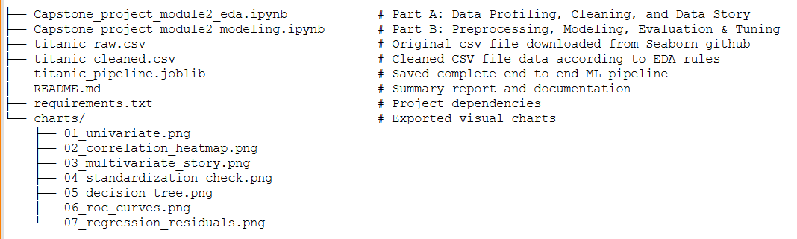
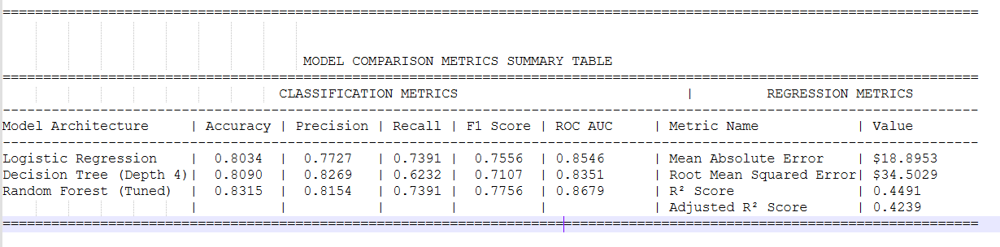

# Titanic Analytics and Predictive Modeling Pipeline

This project is a complete end-to-end data science project built on the classic Titanic dataset. It covers dataset profiling, missing data handling, univariate/bivariate analysis, visual data story, machine learning models, hyperparameter tuning, regression side-task, and pipeline deployment.

The entire module loads the dataset only once and saves titanic.csv inside /analytics as an offline fallback file. All subsequent tasks (EDA and modeling) strictly use this committed CSV.

Folder Structure analytics/

    

# Part A: Data Profiling, Cleaning & Data Story

1. Missing Value Strategy & Threshold Rules:

Missing values were checked across all columns and handled strictly using exact threshold rules:

deck (77.10% Missing): Dropped column completely because missing percentage is greater than 30%. Imputing such high missing values creates unwanted bias.

age (19.87% Missing): Handled via conditional median imputation using pclass and sex groups because missing rate is within the 5% to 30% range.

embarked / embark_town (0.22% Missing): Dropped the 2 missing rows directly because missing percentage is below 5%.

2. Univariate Analysis & Outlier Detectionage Outliers: 

Identified 42 outliers (age > 57 years) using IQR rule [Q1 - 1.5 * IQR, Q3 + 1.5 * IQR].

fare Outliers: Identified 116 outliers (fare $65.65) using IQR rule.

Fare Distribution Skewness:Mean: $32.20 | Median: $14.45 | Mode: $8.05

Conclusion: Since Mean > Median > Mode, the fare distribution is positively right-skewed with a long right tail of high luxury fares.

3. Bivariate Analysis & Key Correlations

Survival Breakdown:

By Sex: Female = 74.20%, Male = 18.89%

By Class: 1st Class = 62.96%, 2nd Class = 47.28%, 3rd Class = 24.24%

By Sex + Class: 1st Class Females had 96.81% survival, whereas 3rd Class Males had 13.54% survival.

Top 2 Off-Diagonal Correlations:

pclass - fare (r = -0.5495): Strong negative correlation showing higher class numbers (3rd Class) pay lower fares.

sibsp - parch (r = +0.4148): Moderate positive correlation showing family members usually traveled together.

4. Visual Data Story Key Points

Chart 1 (Sex & Class): Proves that social status and the "women and children first" policy strongly decided survival chances.

Chart 2 (Fare vs Class): Higher-paying passengers in every class had higher survival rates because their cabins were closer to lifeboat decks.

Chart 3 (Age Distribution): Young children in 2nd and 3rd classes were saved on priority compared to adults.

Chart 4 (Age vs Fare): Mortality was concentrated heavily in young adults (20–40 years) paying low fares below $30.

# Part B: Predictive Modeling & Pipeline

1. Stratified Split Justification

Target variable survived has an imbalanced class distribution (~38.4% survived vs 61.6% died). We used a 80:20 Stratified Train/Test Split to ensure both train and test sets have exact same target class proportions.

2. Data Leakage Prevention

All preprocessing steps (SimpleImputer, OneHotEncoder, StandardScaler) were fit only on the training split and transformed on the test split using scikit-learn Pipeline and ColumnTransformer. No test data was exposed during preprocessing.

3. Class Imbalance Handling Comparison

Evaluated Random Forest under three conditions:

Baseline (No Handling): Precision = 0.7969, Recall = 0.7391, F1 = 0.7669

class_weight='balanced': Precision = 0.7846, Recall = 0.7391, F1 = 0.7612

SMOTE (Train Fold Only): Precision = 0.7432, Recall = 0.7971, F1 = 0.7692

Conclusion: Applying SMOTE inside the training fold gave the highest Recall and best overall F1 score by capturing maximum true survivors.

4. Hyperparameter Tuning & Out-of-Bag (OOB) Score

GridSearchCV Best Parameters: 

{'classifier__max_depth': 6, 'classifier__max_features': 'sqrt', 'classifier__n_estimators': 100}

Out-of-Bag (OOB) Validation Score: 0.8143

5. Regression Side-Task (Predicting Fare)

Metrics: MAE = $18.8953, RMSE = $34.5029, R² = 0.4491, Adjusted R² = 0.4239.

Heteroscedasticity Analysis: The residual plot shows clear heteroscedasticity (uneven spread/fan shape), because low fares are clustered tightly while expensive tickets vary widely.

Model Comparison Summary Table

Note: Classification and Regression metrics operate on different scales and target variables (survived vs. fare).

Final Deployment Recommendation

I recommend deploying the Tuned Random Forest Classifier (titanic_pipeline.joblib). Across all models, Tuned Random Forest achieved the highest Accuracy (83.15%), ROC AUC (0.8679), and F1 Score (0.7756). While the Decision Tree gave slightly higher Precision (82.69%), its Recall was poor (62.32%), missing many real survivors. The Random Forest model offers balanced high Precision (81.54%) and Recall (73.91%), making it stable and reliable for real-world deployment.

**Note: This project was build and tested in google colab notebook. So open the .ipynb file and execute it cell by cell. If it is cloned and executed through VS Code, Please change the file paths (i.e. input csv's, .png file paths) accordingly before executing.**

How to Load and Test Saved Pipeline

The complete pipeline (Preprocessing + Model) is saved as titanic_pipeline.joblib. You can reload and run inference on raw, unseen data with this short script:

Python:

import joblib
import pandas as pd

#Load saved end-to-end pipeline

pipeline = joblib.load("analytics/titanic_pipeline.joblib")

#Pass raw, unprocessed sample input

raw_sample = pd.DataFrame([{
    'pclass': 1,
    'sex': 'female',
    'age': None,  # Test missing value handling
    'sibsp': 0,
    'parch': 0,
    'fare': 150.0,
    'embarked': 'C',
    'who': 'woman',
    'adult_male': False,
    'alone': True
}])

#Predict output directly

prediction = pipeline.predict(raw_sample)[0]
probability = pipeline.predict_proba(raw_sample)[0, 1]

print(f"Prediction: {'Survived' if prediction == 1 else 'Died'}")
print(f"Survival Probability: {probability:.4f}")